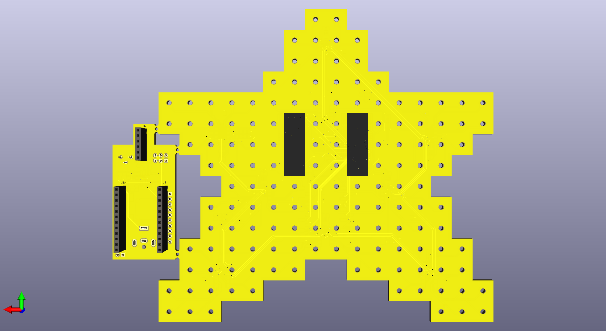

# Starman Christmas Tree Topper

Disclaimer: This work is a *work-in-progress*.  This project is still under
active development and is estimated to be completed _December 1st, 2022_.
What you see here is code that is largely incomplete, buggy, crashes,
and could catch fire. The PCB board is largely inefficient, expensive,
broken, and could catch fire.

Version 1 of the star is a POC I created a few years ago which was literally
a 3d-printed star with 24 LEDs hot-glued onto it, driven by a [LED PWM
driver](https://github.com/adafruit/Adafruit_TLC5947) from Adafruit,
running from an Arduino.

There is a Youtube demo of version 1: https://www.youtube.com/watch?v=mx5et6Ui8Hc but here it is in action.

Version 2 is a complete redesign for 2022, including a custom
PCB, 144 LEDs, 235 components, ESP32-S3 MCU, esp-idf framework, and
WiFi/Bluetooth support.

I plan on producing 10 units for friends and family, but if you are
interested please reach out.  Build cost is currently estimated at
CAD$200.  (I'll post a means to contact closer to Dec 1, 2022:)

## HOW TO PLAY

- Press the button to start the game.
- Start the game with three lives at level 1 (overworld).  If you lose all lives, it's game over.
- There is a 50% chance you will complete each level.  If you do, you move onto next level.  If not, you die and need to retry.
  - Death can occur randomly within the level.
  - Press the button again to start the next level, or retry the same level.
- There is a 40% chance you'll get a star.
  - Stars can occur randomly within the level.
  - Stars do not negate death (ie, falling into a pit).
- There is a 25% chance you'll get a 1-up, resulting in an extra life.
- If you make it to level 4 (castle) and complete it, there is a 25% chance the princess will be there and the game is over.

## TODO

- [X] Finalize PCB design
- [X] Play music
- [ ] Implement game logic
- [ ] Flash lights in sequence with music
- [ ] Create bluetooth/wifi trigger
- [ ] Create onboarding process

## Milestones

2022-09-01
- PCB layout identified and key components selected

2022-09-25
- Components ordered and footprints verified

2022-09-27
- Upgrade from ESP32-S2 to ESP32-S3

2022-09-29
- PCB design delivered for production

## Key Components

- ESP32-S3-Mini module

- 9x LED1642GW drivers

- 144 OSRAM LY P47 2mm LEDs

- PAM8302A amplifer

- 239 total components (35 unique)

- Translate MIDI to Playtune C array
  - https://github.com/lenshustek/miditones

## Build Dependencies

- ESP-IDF framework
  - https://www.thingiverse.com/thing:194864
