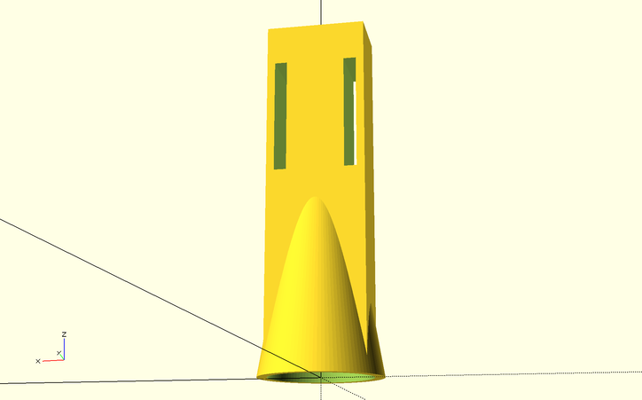

# Starman Christmas Tree Topper

Disclaimer: This work is a *work-in-progress*.  This project is still under
active development and is estimated to be completed _December 1st, 2022_.
What you see here is code that is largely incomplete, buggy, crashes,
and could catch fire. The PCB board is largely inefficient, expensive,
broken, and could catch fire.

Version 1 of the star is a POC I created a few years ago which was literally
a 3d-printed star with 24 LEDs hot-glued onto it, driven by a LED PWM
module from Adafruit, 3 PWM channels for audio, running from an Arduino Uno.

Version 2 is a complete redesign for 2022, including a custom PCB, 144
LEDs, 235 components, ESP32-S3 MCU, esp-idf framework, and WiFi/Bluetooth
support.  Audio is driven by 4 PWM channels, featuring a volume control and
a class-D amplifier.

You can see v2 in action here: https://www.youtube.com/watch?v=h6fquYPDars

The PCB is created using KiCad:

The sound module connects to the spine of the star through 20mm pin socket
risers.  Finally, a 3d-printed mount secures the display to the christmas
tree's top branch via the risers:

I plan on producing 10 units for friends and family for Christmas 2022.
Right now the costs are too high to mass produce, so perhaps sometime in
2023 I can simplify the design and cut costs for general orders.

## HOW TO PLAY

- Press the button to start the game.
- Start the game with three lives at level 1 (overworld).  If you lose all lives, it's game over.
- There is a 50% chance you will complete each level.  If you do, you move onto next level.  If not, you die and need to retry.
  - Death can occur randomly within the level.
  - Press the button again to start the next level, or retry the same level.
- There is a 40% chance you'll get a star.
  - Stars can occur randomly within the level.
  - Stars do not negate death (ie, falling into a pit).
- There is a 25% chance you'll get a 1-up, resulting in an extra life.
- If you make it to level 4 (castle) and complete it, there is a 25% chance the princess will be there and the game is over.

## Installation

1. Install Starman at the top of your tree, or on your desk, shelf, or wall.
2. Connect the play button remote cable to the play button port.  Hide the play button in your tree, desk, shelf, or wall.
3. Power it on.
4. (Optiona) Connect to your wifi network (see below) to configure the brightness and theme.
5. Press the physical play button, or press Play on the Starman web app

### Wifi Setup

1. Power on the Starman
2. Watch for a "starman_######" access point, and connect to it.
3. Search for your home Wifi, and enter the credentials
  - Starman can only connect to 2.4Ghz/WPA2 endpoints
4. Once connected, wait for your IP address to scroll past the screen
5. Open the IP address in your web browser
  - You can now use this site to play Starman directly, and to access the internal API.

If you ever want to factory reset Starman, follow this procedure:
1. Press and hold *Play* button
2. Press and release *Reset* button
3. Release *Play* button
Starman will forget about its current wifi configuration, theme, and configuration. Follow the Wifi Setup instructions above to set it back up again.

## TODO

- [X] Finalize PCB design
- [X] Play music
- [X] Implement game logic
- [X] Unique light pattern per music song/state
- [X] Flash lights in sequence with music
- [X] GPIO play button
- [X] Show simple text messages
- [X] WiFi onboarding process
- [X] Over-the-air firmware updates
- [X] WiFi play button
- [X] HTTP REST API to push text, play sound
- [X] Brightness control
- [X] Selectable themes
- [ ] Document the REST API

## Known Issues

- v2.1 PCB has a label that says it supports 7 to 12 volts power.  *WARNING: only 6-7V is actually supported in v2.1 hardware. __Do not connect more than 7 volts!__*
- Only 2.4Gz WPA2 wifi is supported   (Cannot connect to 5Gz or WPA Enterprise)
- Sound gets distorted at high volume levels.
- It can take a long time after startup to get an IP address and start
  the web service
- Even though wifi and the web service are online and functioning, the
  index.html sometimes takes a long time to load
- Sometimes the device spontaneously resets if wifi connection is not
  stable or strong enough
- Some songs are way too long. (>60s)
- Some songs end way too early (<3s) with a "course completed" event.

## Milestones

2022-09-01
- PCB layout identified and key components selected

2022-09-25
- Components ordered and footprints verified

2022-09-27
- Upgrade from ESP32-S2 to ESP32-S3

2022-09-29
- PCB design delivered for production

2022-10-09
- Complete migration of core game logic from Arduino version (v1) to esp-idf version (v2)

2022-10-29
- Framework for connecting to wifi / performing OTA updates

2022-11-02
- Framework for showing basic text messages, like "Game Over", "Connect to Wifi", "Firmware Update in progress", etc

2022-11-27
- Manufacturing is complete for 10 units for friends and family.

## Key Components

- ESP32-S3-Mini module

- 9x LED1642GW drivers

- 144 OSRAM LY P47 2mm LEDs

- PAM8302A amplifer

- 239 total components (35 unique)

- Translate MIDI to Playtune C array
  - https://github.com/lenshustek/miditones

## Build Dependencies

- See [BUILDING](BUILDING.md) document.
